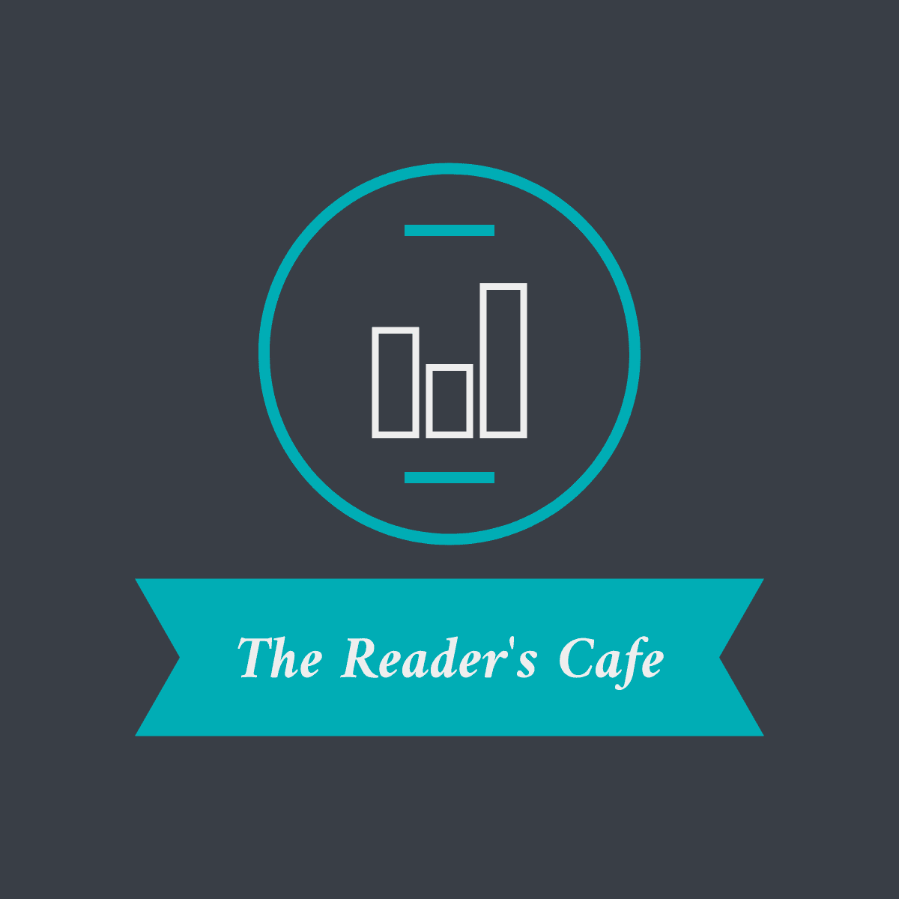

# The Reader's Cafe

WHY READ ALONE?

A fun chat application for book lovers.

## Inspiration

The need to encourage people to read books by making it a fun and interesting thing to do amidst today’s busy lifestyle inspired us to come up with this idea as people nowadays feel it to be a bit boring thing to do.

## Tech Stack used:

MERN Stack
-MongoDB, Express, ReactJS, NodeJS

## Implementation

1. A new user will have to signup first to use the features of this application. An existing user will login.

2. After signing up the user will be taken to a page where he/she will be shown a list of genres like mystery, fantasy etc. and the user will be able to select his favourite ones.

3. The user will be shown existing chat rooms under the genres that he selected. He can join any chat room to chat or he can also create a new chat room.

This will make reading books a little fun activity. People will enjoy reading books just the way they enjoy TV series etc.
This is the main idea.
We have built the login/signup page, the chat application using Socket.io,NodeJS and ReactJS, and the demo landing page of the application.
We have not been able to complete this product within the given time limit but we tried to give our best and we will surely come up with this whole product as we are going to continue working on it.

## Contributors

1. Shree Barua
2. Gargi Ghosal
